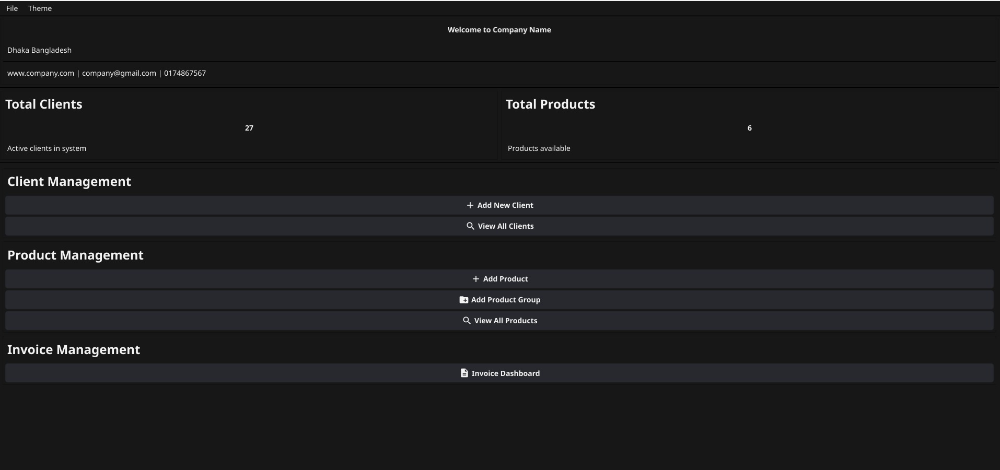
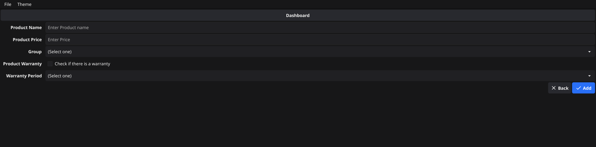
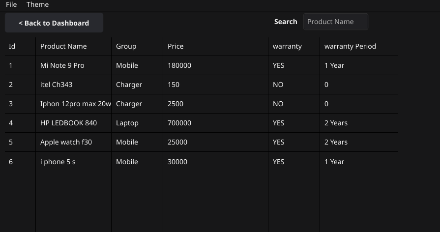
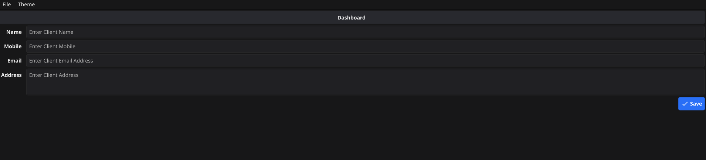
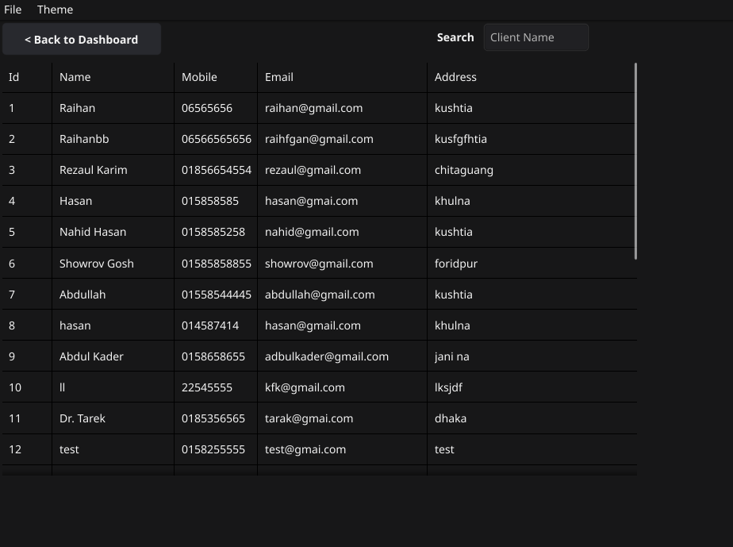
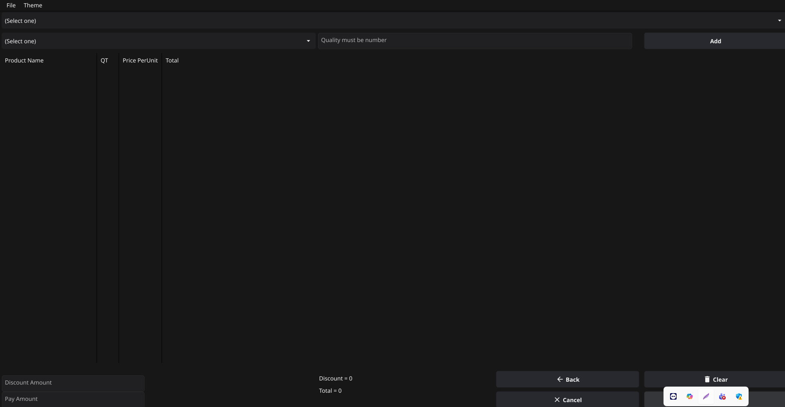

# ERP Desktop System

## Overview
The ERP Desktop System is a robust, cross-platform desktop application designed to streamline enterprise resource planning processes. Built using the **Go** programming language and the **Fyne** framework, this system provides an intuitive user interface for managing business operations such as inventory, sales, and customer relationships.

## Features
- **Modular Design**: Easily extendable modules for inventory, sales, and customer management.
- **Cross-Platform**: Runs seamlessly on Windows, macOS, and Linux.
- **User-Friendly Interface**: Built with Fyne for a modern, responsive GUI.
- **Data Persistence**: Integrates with local or cloud-based databases for secure data storage.
- **Customizable**: Flexible configuration options to suit various business needs.

## Installation
### Prerequisites
- **Go**: Version 1.18 or higher
- **Fyne**: Install the Fyne framework by running:
  ```bash
  go get fyne.io/fyne/v2
  ```
- A compatible database (e.g., SQLite, PostgreSQL) for data storage.

### Steps
1. Clone the repository:
   ```bash
   git clone https://github.com/azizulhoq953/fyne_project.git
   ```
2. Navigate to the project directory:
   ```bash
   cd erp-desktop-system
   ```
3. Install dependencies:
   ```bash
   go mod tidy
   ```
4. Build and run the application:
   ```bash
   go run .
   ```

## Usage
1. Launch the application to access the main dashboard.
2. Use the navigation menu to access modules like Inventory, Sales, or Customers.
3. Configure settings via the preferences panel to customize the application.

## Screenshot








## Example Code
Below is a sample code snippet demonstrating the creation of the main window using the Fyne framework:

```go
package main

import (
	"fyne.io/fyne/v2"
	"fyne.io/fyne/v2/app"
	"fyne.io/fyne/v2/container"
	"fyne.io/fyne/v2/widget"
)

func main() {
	myApp := app.New()
	myWindow := myApp.NewWindow("ERP Desktop System")

	// Create a simple welcome label
	label := widget.NewLabel("Welcome to the ERP Desktop System")
	content := container.NewVBox(label)

	// Set the window content and size
	myWindow.SetContent(content)
	myWindow.Resize(fyne.NewSize(800, 600))
	myWindow.ShowAndRun()
}
```

## Contributing
Contributions are welcome! Please follow these steps:
1. Fork the repository.
2. Create a new branch (`git checkout -b feature/your-feature`).
3. Commit your changes (`git commit -m 'Add your feature'`).
4. Push to the branch (`git push origin feature/your-feature`).
5. Open a pull request.

## License
This project is licensed under the MIT License. See the [LICENSE](LICENSE) file for details.

## Contact
For support or inquiries, please contact [your.email@example.com](mailto:your.email@example.com).